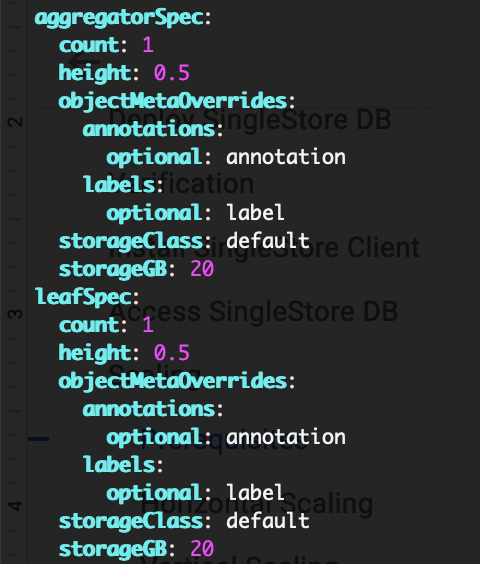
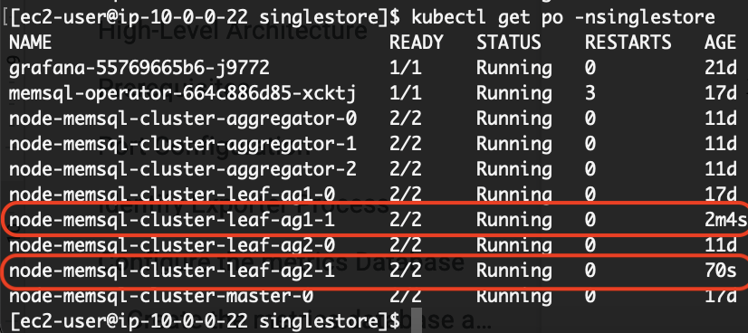
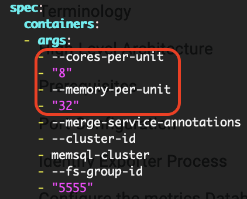
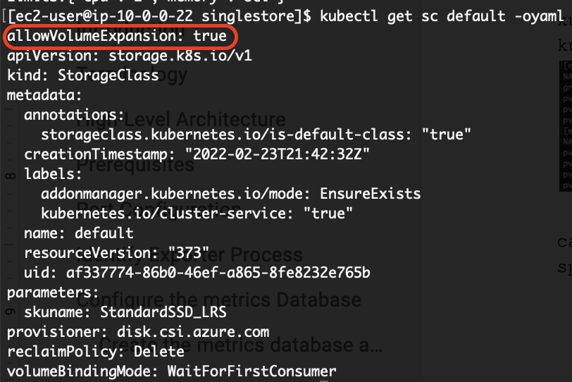

# Scaling

We need to modify the resource only. All jobs are done by operators. You
need to monitor the log of the pod operator during scaling to identify
if the scaling is in progress, done or has a problem.

## Prerequisites

1.  Ensure the backup operator is running and the backup file exists.

2.  Get the memsql cluster

        kubectl get memsqlcluster -n<namespace>

    

3.  Check current spec of MemSQL cluster

        kubectl get memsqlcluster memsql-cluster -n<namespace> -o yaml

    

4.  Definition

        count: number of nodes

        height: cpu & memory limit

        storageGB: storage size

5.  Monitor log of operator

    Open a new terminal window.

        kubectl get po -n<namespace>

    

        kubectl logs memsql-operator-<x> -n<namespace> -f

    

6.  Monitor the pod during scaling

    Open a new terminal window

        watch kubectl get po -n<namespace>

    

## Horizontal Scaling

Increasing the number of cluster nodes. Adding an aggregator or leaf
nodes.

1.  Create scaling patch file:

        cat > scaling.yaml <<EOF
        spec:
          aggregatorSpec:
            count: 1
          leafSpec:
            count: 2
        EOF

2.  Apply your changes on memsql cluster by patching the object using patching file

        kubectl patch memsqlcluster memsql-cluster --type merge --patch-file scaling.yaml -n<namespace>

    

3.  Verification

    New leaves pod created

        kubectl get po -n<namespace>

    

## Vertical Scaling

Increasing node's resources, such as cpu, memory or storage.

### CPU & Memory

Requirement:

The number of cpu & memory defined in args of operator should be greater
than zero

      kubectl get deployment memsql-operator -n<namespace> -oyaml

**Note**: You can do vertical scaling in the current cluster if and only if the number of cores-per-unit or memory-per-unit is greater than zero else you need to recreate a new cluster then reattach the storage.

We have two ways to do vertical scaling

#### Operator

Modify the operator configuration

1.  Edit the memsql-operator deployment

        kubectl edit deploy memsql-operator -n<namespace>

    

2.  Change the number of cores-per-unit or memory-per-unit. Ensure the number greater than zero.

3.  Save the changes

Result:

1.  Old pod operator will destroy

2.  New pod operator will created

3.  Monitor log of new operator

        kubectl logs memsql-operator-<x> -n<namespace> -f

#### Cluster

Modify the node's spec

1.  Create scaling patch file

        cat > scaling.yaml <<EOF
        spec:
          aggregatorSpec:
            height: 0.125
          leafSpec:
            height: 0.25
        EOF

2.  Get the pods

        kubectl get po -n<namespace>|grep node

    Sample output:

      

3.  Check the resource before changes

        kubectl get pods <pod-name> -n<namespace> -o jsonpath='{range .spec.containers[?(@.name=="node")]}{"Container Name:"}{.name}{"\n"}{"Requests:"}{.resources.requests}{"\n"}{"Limits:"}{.resources.limits}{"\n"}{end}'

    Sample output:

    

4.  Apply your changes on memsql cluster by patching the object using patching file

        kubectl patch memsqlcluster memsql-cluster --type merge --patch-file scaling.yaml -n<namespace>

5.  Verification

    Verify the number of cpu & memory is increase as per desired

        kubectl get pod <pod-name> -n<namespace> -o jsonpath='{range .spec.containers[?(@.name=="node")]}{"Container Name:
"}{.name}{"\n"}{"Requests:"}{.resources.requests}{"\n"}{"Limits:"}{.resources.limits}{"\n"}{end}'

    

### Storage

1.  Requirement

    a.  The storage class should be allow volume expansion

        kubectl get sc <sc-name> -oyaml

    

    b.  Support modifying a Disk Size to a larger size only

2.  Check storage

    Check the capacity of pvc/pv.

        kubectl get pvc -n<namespace>

        kubectl get pv

    

3.  Create scaling patch file

        cat > scaling.yaml <<EOF
        spec:
          aggregatorSpec:
            storageGB: 20
          leafSpec:
            storageGB: 25
        EOF

4.  Apply your changes on memsql cluster by patching the object using patching file

        kubectl patch memsqlcluster memsql-cluster --type merge --patch-file scaling.yaml -n<namespace>

5.  Verify

    Check the capacity of pvc/pv.

        kubectl get pvc -n<namespace>

        kubectl get pv

    

### Troubleshoot

1.  Error during resize the storage

    kubectl describe pvc <pvc-name> -n<namespace>

    

    Error message in pod operator:

        errors.go:92 {controller.memsql} Reconciler error will retry after: "55s" error: "Waiting for PVC pv-storage-node-memsql-cluster-leaf-ag1-0 to finish controller resizing"

    Root cause:

    The storage provisioner required detach the pod before resizing the volume

    Solution:

    1.  Delete the pod

        kubectl delete po <pod-name> -n<namespace>

    2.  Downsizing the replicas on related statefulset if option 1 doesn't effect:

        kubectl -n<namespace> patch sts <statefulset-name> --type merge -p '{"spec":{"replicas": 0}}'

        Result:

        1.  The pod will be deleted

        2.  PVC will be resized

        3.  The new pod will recreate
